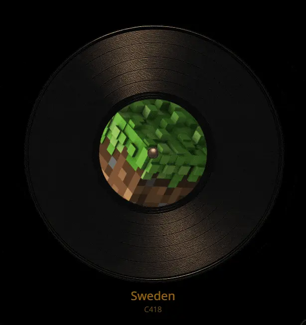

# Spotify Vinyl Frame



A small 2 hours project that displays a spinning vinyl of your currently playing Spotify song.

Part of a bigger project that probably will keep on living inside my mind.

You will need to create a spotify developer project, and insert the client and secret inside a `.env` file (copy the `.env.example`)

```sh
FLASK_SECRET_KEY=adadadadadad # <-- update this
SPOTIFY_CLIENT_ID=123123123123132 # <-- update this
SPOTIFY_CLIENT_SECRET=abababababababababa # <-- update this
BASE_URL=http://localhost:5000
```

> Code quality under the ground, copy pasted from different projects, don't mind it.
